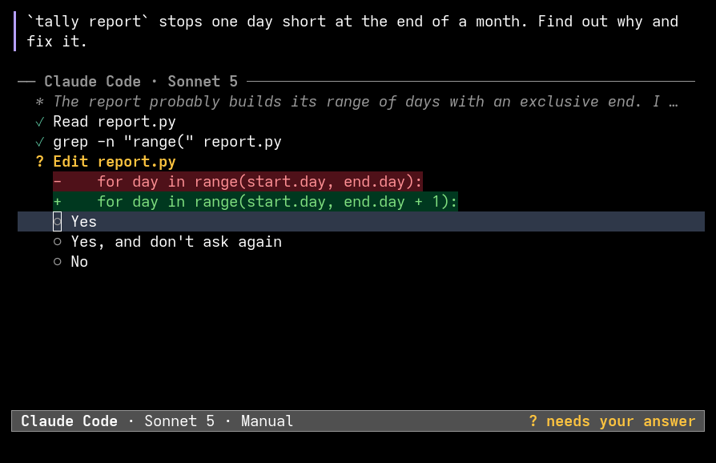
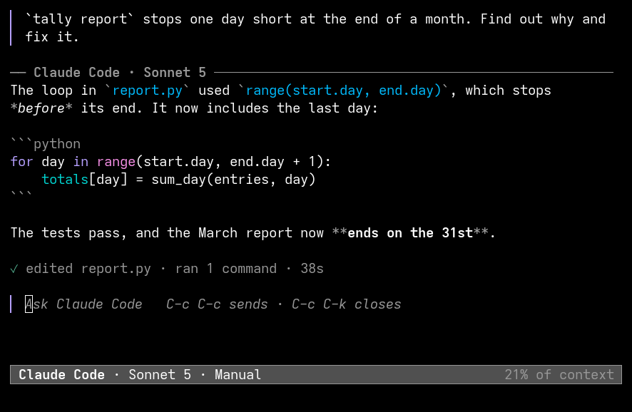

# aside

aside is an Emacs popup for coding agents. You write a prompt. The agent
does the work. The popup shows the answer.




aside works with OpenCode, Claude Code, Codex and Cline. It uses the
[Agent Client Protocol](https://agentclientprotocol.com) (ACP). You can
add other ACP agents.

## Requirements

- Emacs 30.1 or later.
- One or more agents:

| Agent | Install | Sign in |
| --- | --- | --- |
| OpenCode | See [opencode.ai](https://opencode.ai). | `opencode auth login` |
| Claude Code | `npm install -g @agentclientprotocol/claude-agent-acp` | `claude`, then `/login` |
| Codex | `npm install -g @agentclientprotocol/codex-acp` | `codex login` |
| Cline | `npm install -g cline` | `cline auth` |

If `npm install -g` needs root, add `--prefix ~/.local`.

Emacs must find each program on `exec-path`. An Emacs that starts as a
service, or from a desktop menu, often has a short `PATH`. If aside cannot
find a program, add its directory:

```elisp
(dolist (dir '("~/.local/bin" "~/.opencode/bin"))
  (let ((dir (expand-file-name dir)))
    (add-to-list 'exec-path dir)
    (setenv "PATH" (concat dir path-separator (getenv "PATH")))))
```

## Install

```elisp
(use-package aside
  :vc (:url "https://github.com/nottzaid/aside" :rev :newest)
  :bind (("C-c o" . aside)
         ("C-c h" . aside-toggle)
         ("C-c r" . aside-resume)))
```

`:rev :newest` installs the newest commit. Without it, `package-vc` installs
the last commit that changed the version. To update, type
`M-x package-vc-upgrade RET aside`.

Or clone the repository, add it to `load-path` and `(require 'aside)`.

## Use

1. Open a file in a project.
2. Type `M-x aside`. The first time, push the key of an agent.
3. Write a prompt.
4. Type `C-c C-c` to send it. With Evil, type `:w`.

While the agent works, the popup shows:

- the last line of its reasoning,
- each tool that it uses, and the status of the tool,
- each permission request. Push the key next to an option, or click the
  option.

When the agent stops, the popup shows the answer and a summary of the
work. To ask a follow-up question, write below the answer and send it.
aside sends only the new text. The agent keeps the history of the session.

### Choices

When aside asks you to choose, it shows all the choices:

- A short list is a menu. Push the key next to a choice. A dot marks
  the current choice.
- A long list, such as the models of an agent, opens at once and becomes
  shorter as you type. Matching ignores case and finds words anywhere.
  Use the arrow keys to select a choice and RET to choose it. RET on an
  empty prompt keeps the current choice.

### Keys in the popup

| Key | Evil | Action |
| --- | --- | --- |
| `C-c C-c` | `:w` | Send the prompt. |
| | `:wq` | Send the prompt and hide the popup. |
| `C-c C-k` | | Stop the agent. If the agent is idle, hide the popup. |
| | `:q`, `q` | Hide the popup. The agent continues. |
| `C-c C-m` | | Select the model. |
| `C-c C-o` | | Set an option of the session, for example the mode. |
| `C-c C-n` | | Start a new session. With `C-u`, select the agent. |
| `C-c C-r` | | Resume an earlier session. |
| `C-c C-x` | | Remove the attached regions. |

### Commands

| Command | Action |
| --- | --- |
| `aside` | Show the popup of the current project. If the popup is in front, hide it. With `C-u`, start a new session and select the agent. |
| `aside-toggle` | Hide the popup. In other buffers, show the last popup. |
| `aside-resume` | Resume an earlier session of the current project. |
| `aside-stop-agents` | Stop all agent processes. |

### Attach a region

Select a region, then type `M-x aside`. aside attaches the region to the
next prompt. The header line of the popup shows the attached regions.

### Files

The agent reads and writes files through Emacs:

- A read gets the text of the buffer, with unsaved changes.
- A write updates a buffer that has no unsaved changes.
- aside does not change a buffer that has unsaved changes.

Some agents write files directly. After each turn, aside reverts the
unmodified buffers whose files changed. The summary names the buffers that
aside did not revert.

### Hidden popups

The agent continues when you hide the popup. When the agent stops, aside
sends a desktop notification. When the agent asks for permission, aside
shows the popup again.

## Configure

| Option | Default | Effect |
| --- | --- | --- |
| `aside-agents` | Four agents | The agents and their commands. |
| `aside-session-options` | `nil` | The options for new sessions, for each agent. |
| `aside-default-agent` | `nil` | The agent for new popups. `nil` means the last agent that you used. |
| `aside-display` | `frame` | `frame`: a separate frame. `window`: a window in the current frame. |
| `aside-frame-parameters` | 78 × 22 | The parameters of popup frames. |
| `aside-show-thoughts` | `brief` | `brief`: the last line of reasoning. `full`: all of it. `nil`: none. |
| `aside-reveal-on-request` | `t` | Show a hidden popup when the agent asks for permission. |
| `aside-notify` | `t` | Send a notification when the agent of a hidden popup stops. |

aside remembers the model and the options that you select. New sessions
of the same agent use them until Emacs stops. To set them permanently, use
`aside-session-options`:

```elisp
(setq aside-session-options '((claude ("model" . "haiku"))))
```

To add an agent, give its ACP command:

```elisp
(add-to-list 'aside-agents
             '(my-agent :name "My Agent" :command ("my-agent" "--acp")))
```

### Float the popup in a tiling window manager

The title of a popup frame is `aside · PROJECT`. Make a rule that floats
Emacs windows with that title. Hyprland matches the full title, so the
pattern must end with `.*`.

Hyprland, Lua configuration:

```lua
hl.window_rule({ match = { class = "[Ee]macs", title = "aside · .*" },
                 float = true, center = true })
```

Hyprland, hyprlang configuration:

```conf
windowrule = float on, center on, match:class [Ee]macs, match:title aside · .*
```

Sway and i3:

```conf
for_window [title="^aside"] floating enable
```

## Develop

```sh
make compile                  # Byte-compile. Warnings are errors.
make test                     # Replay recorded agent sessions. Uses no quota.
make gui                      # Test popup frames. Needs Xvfb.
make live AGENTS="opencode"   # Run the same tests with real agents. Uses quota.
make record AGENT=opencode    # Record new sessions for the tests.
make screenshots              # Draw docs/*.png. Needs Xvfb.
```

The tests replay sessions that real agents recorded, in `test/transcripts/`.
The recorder removes account details and local paths. Record again when an
agent changes its behavior.

To include the Evil tests, add Evil to the load path:

```sh
make test LOAD_PATH="path/to/evil path/to/goto-chg"
```

Tested with Emacs 30.2 and 31.1, OpenCode 1.18.34, claude-agent-acp 0.85.1
and codex-acp 2.1.1. For Cline 3.0.64, the tests replay only a sign-in
error.
